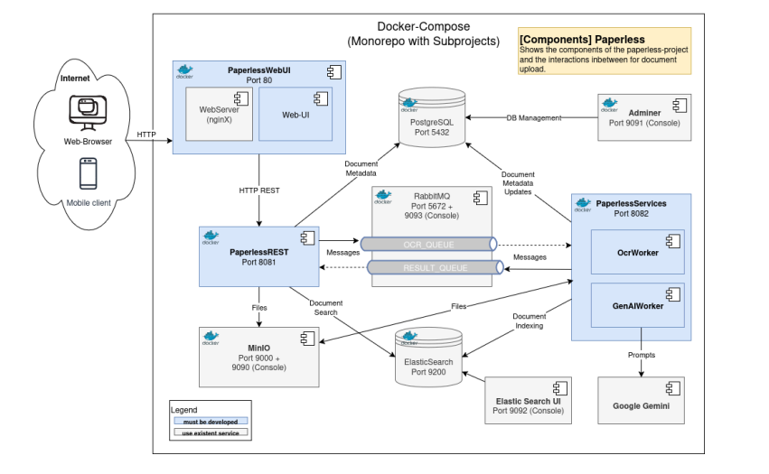

# Document Management System (DMS)

Semester Project for SWEN 3 @ FH Technikum Wien

This project is a microservice-based Document Management System designed to upload, process, analyze, and retrieve documents. It utilizes OCR for text extraction, AI for summarization (Google Gemini), and ElasticSearch for full-text search capabilities.

---

## Project Architecture & Structure

The system follows a distributed microservices architecture tailored for scalability and separation of concerns.



### Modules

| Service | Path | Description | Tech Stack |
| :--- | :--- | :--- | :--- |
| **DocumentDAL** | `/DocumentDAL` | **Core Backend**. Handles CRUD operations, metadata storage, file upload/download, and search queries. | Java, Spring Boot, PostgreSQL, Hibernate, ElasticSearch |
| **OcrWorker** | `/OcrWorker` | **Processing Worker**. Consumes upload events, performs OCR on images/PDFs using Tesseract, and calls GenAI for summarization. | Java, Spring Boot, RabbitMQ, Tesseract, Tess4J |
| **AccessLog** | `/AccessLog` | **Analytics Service**. Tracks document access statistics. (Potential legacy import functionality via XML). | Java, Spring Boot |
| **DocumentGUI** | `/DocumentGUI` | **Frontend**. A responsive web interface for users to upload and manage documents. | HTML5, TailwindCSS, JavaScript |

### Infrastructure Services (Docker)

These services run as containers to support the application:
*   **PostgreSQL**: Primary relational database for document metadata.
*   **MinIO**: S3-compatible object storage for saving actual file content (PDFs, Images).
*   **RabbitMQ**: Message broker for asynchronous communication between services (e.g., triggering OCR after upload).
*   **ElasticSearch**: Search engine for full-text queries on document content.

---

## Getting Started

### Prerequisites
*   **Docker Desktop** (must be installed and running)
*   **Java JDK 21**
*   **Maven** (optional, wrapper included)

### 1. Configure Environment
Create a `.env` file in the root directory (same level as `docker-compose.yaml`) with the necessary credentials.
*Note: A template `.env` might be provided, otherwise standard example values:*
```env
POSTGRES_USER=myuser
POSTGRES_PASSWORD=mypassword
POSTGRES_DB=dms_db

MINIO_ROOT_USER=minioadmin
MINIO_ROOT_PASSWORD=minioadmin

RABBITMQ_USER=guest
RABBITMQ_PASSWORD=guest

ELASTICSEARCH_USER=elastic
ELASTICSEARCH_PASSWORD=changeme

# Optional: Google Gemini API Key for Summaries
GOOGLE_API_KEY=your_key_here
```

## Testing HOWTO
**Integration Test:**
To verify the document upload validation and process integrity:
1. Ensure Docker is NOT running (the test uses in-memory H2 database).
2. Run the test via Maven wrapper or just click on the green Start Button on the left of the Class Name:
   ```bash
   cd DocumentDAL
   ./mvnw -Dtest=DocumentUploadIntegrationTest test